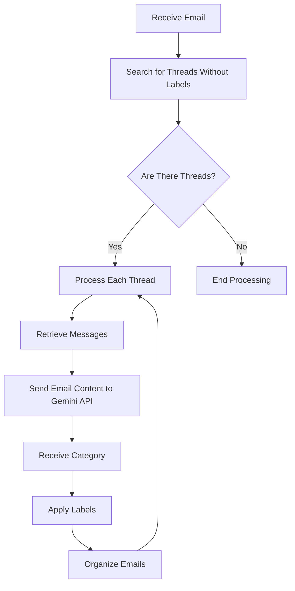

# Gmail Filter By Gemini AI

The Gmail Filter By Gemini AI is a tool built with Google Apps Script that automatically categorizes and labels your Gmail messages. By leveraging the Gemini Pro API, it analyzes email content to apply appropriate labels, streamlining the management of your inbox.

## Demo


## Table of Contents

- [Features](#features)
- [Technologies](#technologies)
- [Installation](#installation)
- [Configuration](#configuration)
- [Usage](#usage)
- [Flowchart](#flowchart)

## Features

- **Automatic Classification**: Utilizes the Gemini Pro API to analyze email content and categorize it accordingly.
- **Label Management**: Automatically applies and manages Gmail labels based on classification results.
- **API Rate Limit Handling**: Incorporates appropriate delays between requests to avoid hitting API rate limits.
- **Flexible Customization**: Allows customization of categories and labels as needed.

## Technologies

- [Google Apps Script](https://developers.google.com/apps-script)
- [Gmail API](https://developers.google.com/gmail/api)
- [Gemini Pro API](https://cloud.google.com/ai-platform/gemini)
- [Mermaid](https://mermaid-js.github.io/mermaid/#/)

## Installation

1. **Create a Google Apps Script Project**
    - Visit [Google Apps Script](https://script.google.com/) and create a new project.

2. **Copy the Script**
    - Copy the `GmailFilter.gs` file from this repository and paste it into your project.

3. **Add Necessary Libraries**
    - No additional libraries are required. The script uses standard Google Apps Script libraries.

## Configuration

1. **Obtain an API Key**
    - Acquire an API key for the Gemini Pro API from the [Google Cloud Console](https://console.cloud.google.com/).

2. **Set the API Key in the Script**
    - Replace the `apiKey` variable in `GmailFilter.gs` with your actual API key.

    ```javascript
    const apiKey = 'yourapikey'; // Replace with your actual API key
    ```

3. **Create Gmail Labels**
    - In Gmail, create the following labels:
        - Applied
        - Ad News
        - Ad Jobs
        - Rejection
        - Acceptance
        - Account Notice
        - Unknown
        - Event
        - Interview

## Usage

1. **Run the Script**
    - In the Google Apps Script editor, select the `GmailFilter` function and execute it.

2. **Set Up Triggers**
    - To run the script automatically at regular intervals:
        - Click the "Triggers" (clock) icon in the editor.
        - Add a new trigger, selecting the `GmailFilter` function and setting an appropriate execution schedule.

3. **Monitor Logs**
    - After execution, use `Logger.log` to review logs and monitor the processing status.

## Flowchart

The following flowchart illustrates the processing flow of the script.


